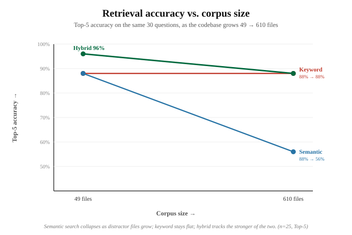
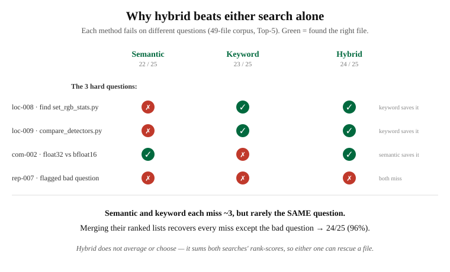

# Graphical analysis

The two figures that summarize the retrieval evaluation. Both are measured
results, reproducible from the scripts in `evaluation/`.

---

## Figure 1 — Retrieval accuracy vs. corpus size

**What it shows.** Top-5 retrieval accuracy for the same 30 questions as the
codebase grows from 49 to 610 files. Three retrieval strategies are compared:

- **Semantic (blue)** collapses from 88% to 56%. Meaning-based search cannot
  separate the right file from hundreds of legitimately similar lab scripts once
  the corpus is large.
- **Keyword / BM25 (red)** stays flat at 88%. Exact technical terms remain
  discriminative no matter how many files are added.
- **Hybrid (green)** starts highest (96%) and tracks the stronger of the two
  methods as the corpus grows, landing at 88%.

**The takeaway:** the sophisticated method is the fragile one. This single
figure is the core result of the project.

*Note: the line is drawn between two measured endpoints (49 and 610 files).
Intermediate corpus sizes are a planned addition.*

---

## Figure 2 — Why hybrid beats either search alone

**What it shows.** The four hardest questions on the 49-file corpus, and whether
each search method retrieved the right file (green check) or missed (red X).

- Semantic misses the exact-filename questions (loc-008, loc-009) — but keyword
  catches them.
- Keyword misses the concept question (com-002, "float32 vs bfloat16", which
  shares no words with the answer) — but semantic catches it.
- Only rep-007 is missed by both, and it is a flagged, unverified question.

**The takeaway:** semantic and keyword fail on *different* questions, so merging
their ranked lists recovers nearly every individual miss. Hybrid does not
average the two or pick one — it sums both searches' rank-scores, so either
method can rescue a file the other missed. That is the mechanism behind the 96%.

---

## Related analysis

- `docs/hybrid-RAG-model.md` — full plain-language writeup of the system
- `docs/baseline-comparison.md` — the baseline numbers behind Figure 1
- `docs/hybrid-results.md` — the hybrid run behind Figure 1
- `docs/bias-analysis.md` — verification that the keyword baseline is not an
  artifact of the benchmark
